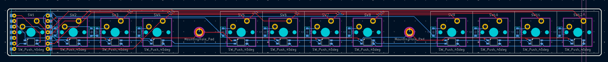

# windF12 Journal

## September 8

Whilst talking to @One For Freedom on HC slack, I was scrolling through his projects when his f row keyboard caught my eye. He told me that he made it wired, but I thought that it really shouldn’t be that hard to make it wireless, so here we go.

I used a XIAO nRF52840 because it had BT and the nRF chip is supported by zmk, so that might finally be my entry point into zmk.
There are 12 keys setup like on a normal full keyboard. I removed the overhang that the Xiao would create by showing it under the 1st switch which I’ve done on a previous keyswitch containing product.
I will solder the battery by BEFORE soldering the Xiao giving it 2 wires on the respective pads on its bottom (it will be an absolute horror to fix if it breaks).
The diodes I’m using are SOD-123 1N4148 diodes, so smd, but its fine and they aren’t that small.

That’s about it, maybe some small changes in the future.

Here are some images of my pcb:

 
 

## September 9 - Silkscreen

I asked ChatGPT for some logo inspiration, and it gave me a very simple logo with ‘wind’ at the top and all me keyboard numbers under it, so I decided to make that into my branding as it looks cool and I like it really much.

 

It’s very simple and I’ve applied it to all my projects.

When I saw the price of the Xiao BLE I was frankly shocked. So seeing that all the Xiao boards have the same footprint, I might just replace it with an rp2040 if its too expensive.