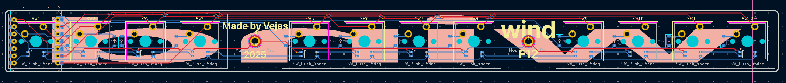

# windF12
A 12 key F row replacement for people that use 60% keyboards.

***

# What is it?
The windF12 is an F-row for people that use a 60% keyboard or play Minecraft on a MacBook like me.
It's main purpose is to provide the F keys to the user (duh).
It can be used wired or wirelessly depending on what Seeed Xiao you pick.
For wired (or ambitious wireless) users you can also add SK6812MINI-E leds under the keys for cool lighting effects.

***

# Components
This keyboard needs:
- 12 MX switches
- 12 1N4148 SOD-123 diodes
- 1 seeed XIAO
- optionally 12 SK6812MINI-E Leds
- 1 PCB

***

# Images
***
## PCB
 
 
